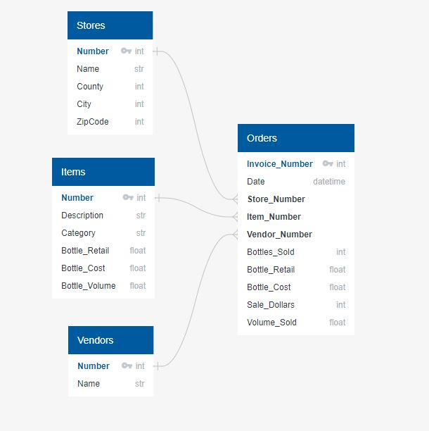
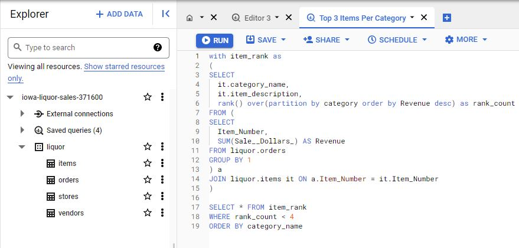
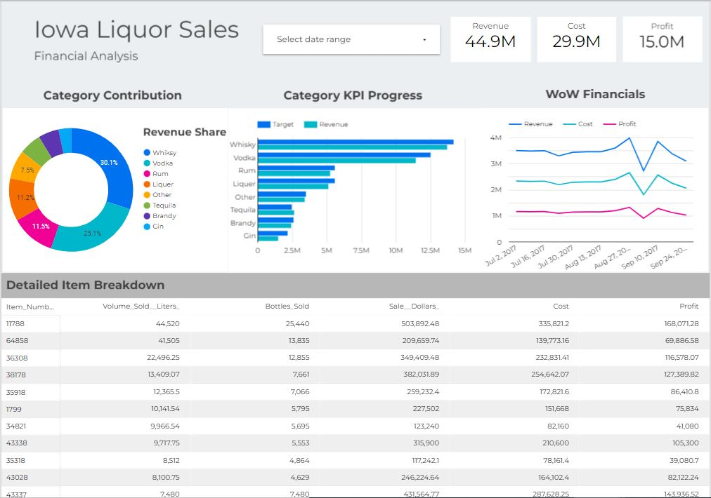

# End to End SQL Dashboard -- Iowa Liquor Sales

### Table of Contents
1) [Introduction & Problem Statement](#introduction-&-problem-statement)
2) [Data Collection & Cleaning](#data-collection-&-cleaning)
3) [Metrics](#EDA)
4) [Dashboard](#Modeling)

### Introduction & Problem Statement 
For this project I am in the role of a Data Analyst for a large alcohol distributor based in the state of Iowa. My task is to build a dashboard that will enable the finance and operations teams to better understand how the company is performing.

Approach
1. Define Metrics to Analyze the Business 
2. Collect & Clean the Data
3. Analyze the Data w/SQL
4. Build Dashboard in Looker Datastudio
---
### Define the Problem
Finance & Operations gave us a fairly high level task of building a dashboard to help them stay on top of how the business is performing. After some back and forth we aligned on two asks to incorporate into our dashboard, an overview with how the financials are trending and some insights on which categories and items are driving the business.

Finanical Overview
 Revenue- Sum of dollars brought in from each sale
 Cost - Cost of the items sold
 Profits - Revenue less Cost

Category & Item Insights
 How are categories performing against their revenue targets?
 Which items are performing well and not so well?
 Are there any items that we should delist from our assortment?

### Data Collection & Cleaning
The Iowa Department of Commerce requires that every store that sells alcohol in bottled form for off-the-premises consumption must hold a class "E" liquor license (an arrangement typical of most of the state alcohol regulatory bodies). All alcoholic sales made by stores registered thusly with the Iowa Department of Commerce are logged in the Commerce department system, which is in turn published as open data by the State of Iowa.
 [Department of Commerce Data](https://www.kaggle.com/datasets/residentmario/iowa-liquor-sales)

Cleaning Steps
1. Check for Duplicates
2. Handle Null Values (Drop or Impute)
3. Convert to appropriate Data Types
4. Validations (Outliers, Categories, Equations)

### Database Construction & SQL BigQuery

I have constructed four tables Stores, Items, Vendors, and Orders. The store, items, and vendors table are simple repositories storing one row with various features associated with each store, item, and vendor that can be joined with the orders table via the respective primary keys. The orders table captures one row for each invoice associated with a liquor sale in the state of Iowa. It contains various features that will allow us to calculate and analyze liquor sales. 

After I cleaned and prepared the data I was able to creates these tables in python and load them into Google's BigQuery where I can then run custom SQL queries to explore the data further prior to building the dashboard. Below is a quick view of what this step looks like in BigQuery, here I have written a query to identify the top 3 selling items within each category.

### Dashboard -- Looker DataStudio --
Below is a screenshot and link to the dashboard that I built in DataStudio. I built this dashboard using a combination of custom SQL queries via Google BigQuery and aggregations on the imported datatables I created with python. At the top of the dashboard you will see a date range bar, here you can filter which time period you would like to see data aggregated for and the charts below will seamlessly update. As I have only carried over data for Q3 2017 please filter for dates between this time period. To the right of the date range I have a few scorecard figures including revenue, cost, and profit. If I filter for September 1 - September 30 I will see that months figures as well as the month over month %change.

[Link to DashBoard](https://datastudio.google.com/reporting/6fde93f7-c164-4872-be49-866e6942a2c6)

Pie Chart - This chart provides a visual of the revenue contribution % by Parent Category to provide the viewer with a high level look at what parts of the business are driving sales.

KPI Tracker - This horizontal bar charts shows how revenue within each category is tracking against the revenue targets set by the Management team.

WoW Financials- This line plot shows the fluctuations in week over week aggregated financial metrics. 

Item Breakdown- This simple pivot table allows us to see the volume of sales and financials aggregated at an item level. 

### Recommendations
If we filter the item breakdown we can see there are 76 items with fewer than $100 in sales YTD and no sales in the most recent period. Unless these are seasonal items I would recommend coordinating with the buying team to determine whether these products should be delisted due to their poor performance.

Secondly if we look at the WoW financials, there is a clear dip in Sales at the beginning of September. If Finance & Operations team are unaware of any explanatory event we can dive deeper into this period to identify which stores & items were underperforming and why. (i.e. store closures, severe weather, items out of stock, etc.) 